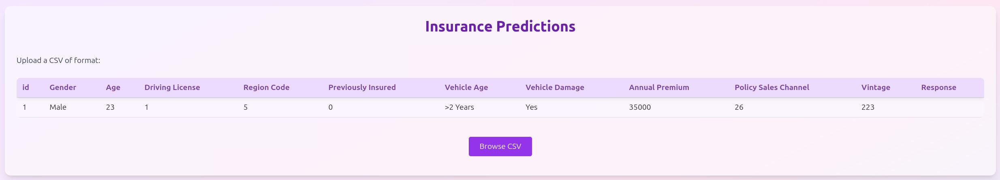
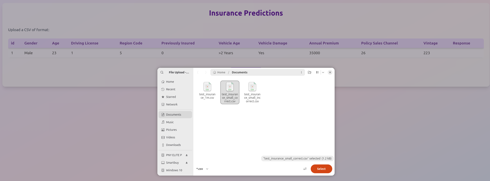
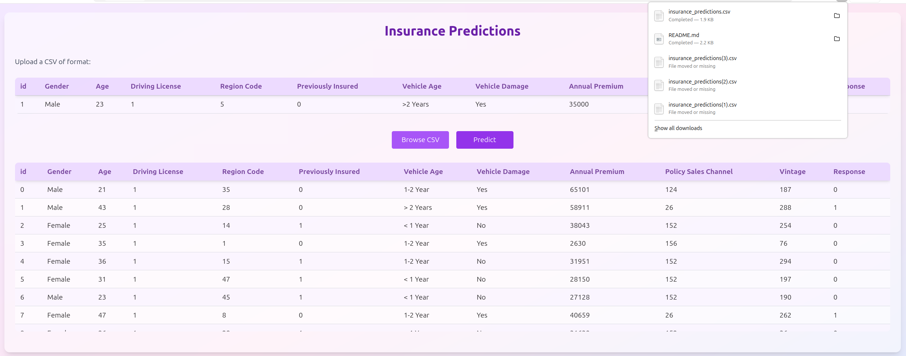

# Insurance Prediction Web Application

This project is a web application for insurance prediction using CatBoost and React. It allows users to upload CSV files, preview data, and get predictions for insurance claims. The frontend is built with React and Vite, while the backend uses FastAPI and CatBoost for model inference.

## Project Structure

```
insurance-cross-sell/
├── backend/                          # FastAPI + CatBoost backend
│   ├── models/                       # Pre-trained ML models and data
│   │   ├── catboost_model_all_gpu.pkl   # CatBoost inference model
│   │   ├── preprocessor.pkl             # Feature preprocessing pipeline
│   │   └── Tresholds.csv                # Classification thresholds
│   ├── services/
│   │   ├── __init__.py
│   │   ├── predict_service.py        # Prediction orchestration
│   │   └── preprocessor.py           # Data preprocessing
│   ├── main.py                       # FastAPI application entry point
│   ├── requirements.txt              # Python dependencies
│   ├── Dockerfile                    # Backend container configuration
│
├── web-frontend/                     # React + Vite + TypeScript frontend
│   ├── src/
│   │   ├── api/
│   │   │   └── client.ts             # Backend API client
│   │   ├── components/               # React UI components
│   │   │   ├── UploadCSV.tsx         # CSV file upload component
│   │   │   └── PredictionTable.tsx   # Results display component
│   │   ├── types/
│   │   │   └── prediction.ts         # TypeScript type definitions
│   │   ├── utils/                    # Utility functions
│   │   ├── App.tsx                   # Main application component
│   │   ├── main.tsx                  # React entry point
│   │   └── index.css                 # Global styles
│   ├── public/                       # Static assets
│   │   └── vite.svg
│   ├── Dockerfile                    # Frontend container configuration
│   ├── nginx.conf                    # Nginx configuration for production
│   ├── vite.config.ts                # Vite build configuration
│   ├── tailwind.config.js            # Tailwind CSS configuration
│   ├── tsconfig.json                 # TypeScript configuration
│   ├── package.json                  # Node.js dependencies
│   ├── package-lock.json
│   └── node_modules/                 # Node.js packages (excluded from git)
│
├── images/                           # The images we use for this README
│
├── docker-compose.yml                # Docker Compose orchestration
├── .gitignore                        # Git ignore rules
├── LICENSE                           # Project license
└── README.md                         # This file
```

## Installation & Deployment

### Prerequisites

- Docker
- Docker Compose

### Running the Project

Build and start both frontend and backend using Docker Compose:

```bash
docker-compose up --build
```

This will:

- Build images for both frontend and backend
- Start the frontend (served by Nginx) at `http://localhost:5173`
- Start the backend API at `http://localhost:5173/api`

If you wish to expose other ports, we recommend writing a docker-compose.override.yml

To stop the services:

```bash
docker-compose down
```

## Backend API Interface

### Endpoints

#### POST /predict-csv

Upload a CSV file for prediction.

**Request Body:**

- CSV file (`multipart/form-data`)

**Response:**

- JSON array with predictions for each row

### Example Request

```bash
curl -X POST -F "file=@data.csv" http://localhost:5173/api/predict-csv
```

### Example Response

```json
[
  {
    "id": 1,
    "Gender": "Male",
    "Age": 23,
    "Driving_License": 1,
    "Region_Code": 5,
    "Previously_Insured": 0,
    "Vehicle_Age": ">2 Years",
    "Vehicle_Damage": "Yes",
    "Annual_Premium": 35000,
    "Policy_Sales_Channel": 26,
    "Vintage": 223,
    "Response": 1
  }
]
```

## Notes

- The frontend uses Vite for development and Nginx for production deployment.
- The backend uses FastAPI for API handling and CatBoost for model inference.
- Model files and preprocessing parameters are loaded at startup.
- The application is containerized using Docker Compose for unified deployment.

## Frontend usage

Using the web service is fairly easy:

1. Visit the frontend page at `http://localhost:5173` and press the "Upload CSV" button
   
2. Select the .csv file with the data in the format specified on the frontend (the "Response" column is optional)
   
3. Click the "Predict" button as your data preview appears, you should get your result as a .csv file and be able to see a preview of the prediction too!
   
